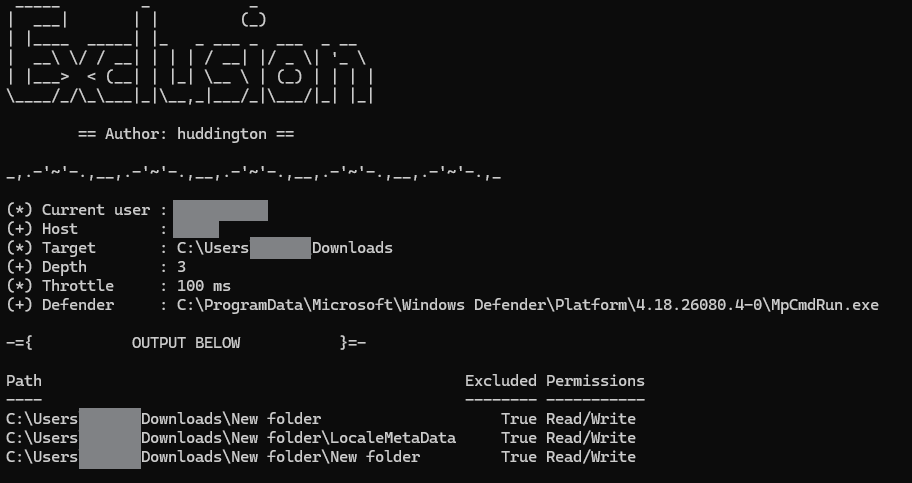

# Exclusion

A PowerShell tool for enumerating effective Microsoft Defender exclusions on a target directory and its subdirectories. For each excluded path it also reports your current user's filesystem permissions, giving you a clear picture of what Defender is ignoring and what you can access within it.

Probing is done via `MpCmdRun.exe` so no third-party dependencies are required.



---

## Usage

```powershell
.\exclusion.ps1 -Directory <path> [-Depth <1-4>] [-ThrottleMs <0-5000>] [-Output <file>]
.\exclusion.ps1 -Help
```

---

## Parameters

| Parameter     | Default      | Description                                                                                                        |
| ------------- | ------------ | ------------------------------------------------------------------------------------------------------------------ |
| `-Directory`  | _(required)_ | Root directory to scan                                                                                             |
| `-Depth`      | `1`          | Recursion depth below the root (1-4)                                                                               |
| `-ThrottleMs` | `100`        | Delay in ms between MpCmdRun calls (0–5000). Increase if your EDR flags rapid process creation                     |
| `-Output`     | _(none)_     | Optional file to save results. Format is inferred from extension: `.csv`, `.json`, or plain text for anything else |
| `-Help`       |              | Show help and exit                                                                                                 |

---

## Examples

Scan a single directory at default depth:

```powershell
.\exclusion.ps1 -Directory "C:\Tools"
```

Scan recursively 3 levels deep:

```powershell
.\exclusion.ps1 -Directory "C:\Tools" -Depth 3
```

Scan and save results to CSV:

```powershell
.\exclusion.ps1 -Directory "C:\Tools" -Depth 2 -Output results.csv
```

Slow the probe down to avoid detection:

```powershell
.\exclusion.ps1 -Directory "C:\Tools" -ThrottleMs 500 -Output results.json
```

---

## Output

Each excluded path is returned as an object with three fields:

|Field|Description|
|---|---|
|`Path`|Full path of the excluded directory|
|`Excluded`|Always `True` for returned results|
|`Permissions`|Your effective permissions on that path: `Read`, `Write`, `Read/Write`, `None`, or `Unknown`|

Results are printed to the console and optionally saved to a file.

---
